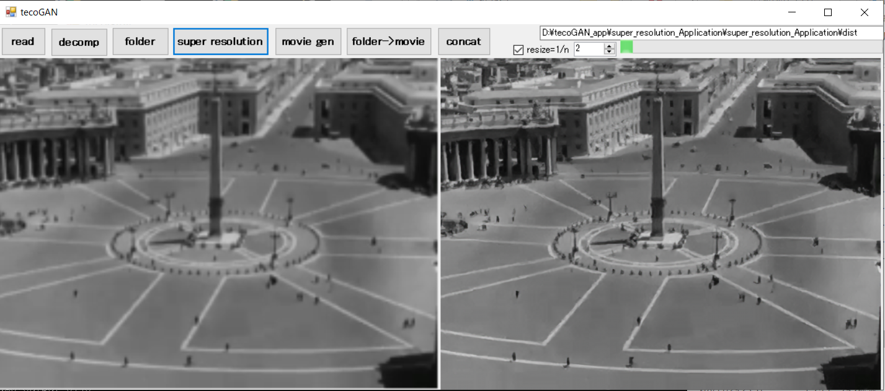
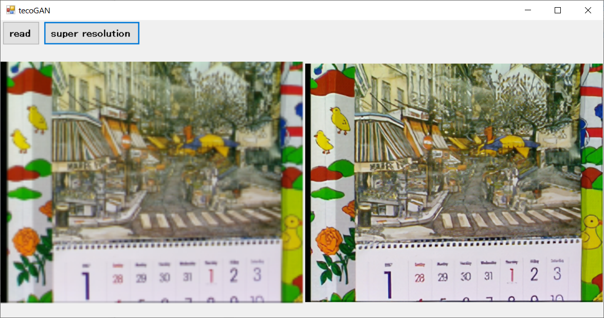

# tecoGAN_app  

`..........original................. tecoGAN ..........`
  
[Roman Holiday (1953) Original Trailer](https://www.youtube.com/watch?v=X_hyQgdGmU8)  
* * * *
Windows application


old version

* * * *
[tecoGAN](https://github.com/thunil/TecoGAN)

  
#  
**Windows10+Anaconda3**
## Requirements  
ImageMagick-7.0.10-Q16

#### GPU  
```
pip install --ignore-installed --upgrade tensorflow-gpu==1.15.0.

pip install torch==1.5.0+cu92 torchvision==0.6.0+cu92 -f https://download.pytorch.org/whl/torch_stable.html
```

#### CPU  
```
pip install --ignore-installed --upgrade tensorflow==1.15.0.
```

#### CPU  & GPU
```
pip install numpy>=1.14.3
pip install scipy>=1.0.1
pip install scikit-image>=0.13.0
pip install matplotlib>=1.5.1
pip install pandas>=0.23.1
pip install Keras>=2.1.2
pip install opencv-python>=2.4.11
pip install ipython>=7.4.0


```

_ _ _
##memo
## How to super-resolution video
Converts videos into serialized images.

`ffmpeg -i test.mp4 -vcodec png main/LR/calendar/image_%04d.png
`  
**super-resolution**  
`tecoGAN.bat`

output -> main/results/output_%03d.png
To return the output result to a movie, do as follows.  

`ffmpeg -r 24 -i output_%04d.png -vcodec libx264 -pix_fmt yuv420p -r 24 test.mp4`  

Change the codec and format accordingly. Since "24" in the command is the frame rate, enter the frame rate of the original movie.
